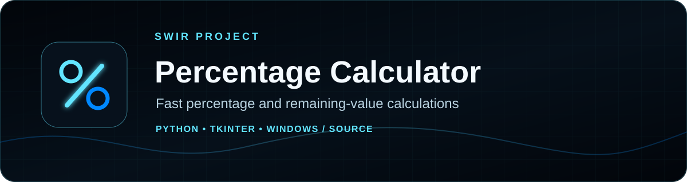
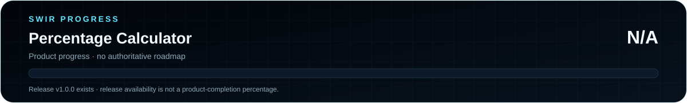

<!-- SWIR-README-STANDARD:v2 -->

<div align="center">



<br>


<br>


[**Highlights**](#-highlights) · [**Quick Start**](#-quick-start) · [**Status**](STATUS.md) · [**Releases**](#-releases)

</div>


## 📍 Project Status

| Item | Status |
|---|---|
| Current stage | Released lightweight utility |
| Current public release | [v1.0.0](https://github.com/Swir/Procent-calkulator/releases/tag/v1.0.0) |
| Runtime | Windows EXE or Python 3 + Tkinter |
| Product roadmap | Not defined; product completion is intentionally **N/A** |
| Detailed status | [STATUS.md](STATUS.md) |



**Product progress: N/A.** This repository has no authoritative product roadmap, so release availability is not presented as a completion percentage.

## 🚀 Overview

**Percentage Calculator** is a small desktop utility that calculates a selected percentage of a base value and the amount remaining after that percentage is subtracted. The current source is a single-file Python/Tkinter application and its interface text is in Polish.

## ✨ Highlights

| Feature | What it does |
|---|---|
| 🔢 Base value | Accepts a numeric starting value |
| `%` Percentage | Calculates the requested percentage of the base value |
| ➖ Remaining value | Shows the amount left after subtracting the calculated percentage |
| 🧯 Input validation | Displays an error dialog when the two input fields cannot be parsed as numbers |
| 🪶 Lightweight source | Uses only Python's standard Tkinter/ttk GUI stack |
| 📦 Windows release | v1.0.0 includes a standalone EXE, portable ZIP and SHA-256 file |

## ⚙️ Quick Start

### Recommended — Windows release

Download **v1.0.0** from [GitHub Releases](https://github.com/Swir/Procent-calkulator/releases/tag/v1.0.0). The release contains `Procent-Calculator.exe`, a Windows x64 ZIP package and a SHA-256 checksum file.

### From source

```bash
git clone https://github.com/Swir/Procent-calkulator.git
cd Procent-calkulator
python Calculator.py
```

A Python 3 installation with Tkinter support is required when running from source.

## 📋 Requirements / Compatibility

- **Windows:** the published v1.0.0 release is packaged as a Windows x64 executable.
- **Source:** Python 3 with Tkinter/ttk.
- **Language:** the current application UI is Polish.
- No third-party Python package is imported by `Calculator.py`.

## 🎮 Usage

1. Enter the base value in **Wartość**.
2. Enter the percentage in **Procent**.
3. Select **Oblicz**.
4. Read both the calculated percentage amount and the remaining value.

Example: for a base value of `1000` and `20%`, the application reports `200` as the percentage amount and `800` as the remaining value.

## 🧠 Technology

| Layer | Technology / role |
|---|---|
| GUI | Python `tkinter` + `ttk` |
| Calculation | Floating-point percentage and subtraction |
| Windows packaging | PyInstaller in the repository release workflow |
| Release artifacts | EXE + ZIP + SHA-256 |

## 🗺️ Roadmap / Progress

There is currently no authoritative product roadmap in this repository. To avoid inventing readiness, product completion remains **N/A**. See [STATUS.md](STATUS.md) for the compact status view.

## 📦 Releases

Latest verified public release: **[v1.0.0](https://github.com/Swir/Procent-calkulator/releases/tag/v1.0.0)**.

The release workflow builds `Procent-Calculator.exe`, packages a Windows x64 ZIP and writes a SHA-256 checksum. Documentation-only migration does not change the application version or published release.

## ⚠️ Current Limitations

- The program implements one calculation flow: percentage amount plus remaining value.
- The current UI language is Polish only.
- Numeric calculations use Python floating-point values; this utility is not designed as a financial-precision engine.
- No repository product roadmap currently defines a measurable completion percentage.

## 🔎 Search Keywords

`percentage calculator python` • `windows percentage calculator` • `tkinter calculator` • `percentage of value calculator` • `remaining value calculator` • `offline percentage calculator` • `python desktop calculator` • `discount percentage utility` • `commission percentage calculator` • `lightweight windows calculator`


<div align="center">

### `CALCULATE • VERIFY • KEEP IT SIMPLE`

⭐ **If this utility is useful, consider leaving a star.**

[**← SWIR profile**](https://github.com/Swir) · [**All projects →**](https://github.com/Swir?tab=repositories)

</div>
